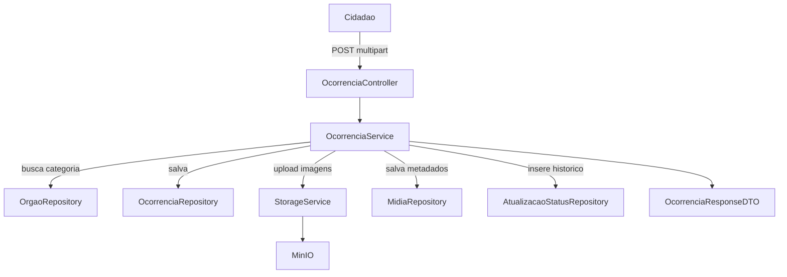

# Plano de Implementação do Backend zUrbi

## Escopo e decisões já fixadas
- Manter migrações atuais e **não editar migrações já criadas**: preservar `[V1__create_tables.sql](/Users/gustavo/Desktop/ZUrbi/zurbi-backend/src/main/resources/db/migration/V1__create_tables.sql)` e `[V2__seed_data.sql](/Users/gustavo/Desktop/ZUrbi/zurbi-backend/src/main/resources/db/migration/V2__seed_data.sql)` como histórico; criar novas migrações `V3__...` em diante.
- Se não houver órgão para a categoria no registro da ocorrência, salvar com `orgao_id` nulo (triagem posterior), consistente com `[business-rules.md](/Users/gustavo/Desktop/ZUrbi/docs/business-rules.md)`.
- Manter padrão por feature, DTO separado de entidade e nomes em português, conforme `[project-architecture.md](/Users/gustavo/Desktop/ZUrbi/docs/project-architecture.md)`.

## Etapa 1 — Infraestrutura e dependências
- Atualizar `[pom.xml](/Users/gustavo/Desktop/ZUrbi/zurbi-backend/pom.xml)` com dependências faltantes: `minio`, `commons-io` e `spring-security-crypto` (para `BCryptPasswordEncoder`), mantendo as já existentes.
- Completar `[application.properties](/Users/gustavo/Desktop/ZUrbi/zurbi-backend/src/main/resources/application.properties)` com blocos de MinIO e ajustes de Flyway/JPA via `${VAR:default}`.
- Ajustar `[docker-compose.yml](/Users/gustavo/Desktop/ZUrbi/docker-compose.yml)` para incluir `minio` + `app` com variáveis de ambiente necessárias (`MINIO_*`, datasource e bucket).
- Revisar `[Dockerfile](/Users/gustavo/Desktop/ZUrbi/Dockerfile)` para build em 2 estágios com cache eficiente e execução do jar final.

## Etapa 2 — Banco de dados (sem reescrever histórico)
- Criar nova migration `V3__create_midia_table.sql` em `[db/migration](/Users/gustavo/Desktop/ZUrbi/zurbi-backend/src/main/resources/db/migration)` com:
  - tabela `tb_midia`
  - FK `ocorrencia_id` com `ON DELETE CASCADE`
  - índice em `ocorrencia_id`
- Criar migration complementar (se necessário) para constraints de enums/checks que estejam faltando no modelo atual (sem alterar `V1`).

## Etapa 3 — Enums e configurações de storage
- Preencher enums em `[shared/enums](/Users/gustavo/Desktop/ZUrbi/zurbi-backend/src/main/java/br/com/zurbi/shared/enums)` com os valores definidos.
- Implementar `[MinioConfig.java](/Users/gustavo/Desktop/ZUrbi/zurbi-backend/src/main/java/br/com/zurbi/config/MinioConfig.java)`:
  - bean `MinioClient`
  - rotina de startup para garantir bucket existente.
- Implementar `[StorageService.java](/Users/gustavo/Desktop/ZUrbi/zurbi-backend/src/main/java/br/com/zurbi/shared/storage/StorageService.java)`:
  - `upload(MultipartFile, UUID ocorrenciaId)` retornando `StorageResult`
  - validação `contentType` iniciando com `image/`
  - chave `ocorrencias/{ocorrenciaId}/{uuid}.{ext}`
  - `deletar(storageKey)`.

## Etapa 4 — Entidades JPA e módulo de mídia
- Ajustar entidades existentes com `@PrePersist`, `FetchType.LAZY` e mapeamentos bidirecionais necessários:
  - `[Usuario.java](/Users/gustavo/Desktop/ZUrbi/zurbi-backend/src/main/java/br/com/zurbi/modules/usuario/Usuario.java)`
  - `[Orgao.java](/Users/gustavo/Desktop/ZUrbi/zurbi-backend/src/main/java/br/com/zurbi/modules/orgao/Orgao.java)`
  - `[Ocorrencia.java](/Users/gustavo/Desktop/ZUrbi/zurbi-backend/src/main/java/br/com/zurbi/modules/ocorrencia/Ocorrencia.java)`
  - `[AtualizacaoStatus.java](/Users/gustavo/Desktop/ZUrbi/zurbi-backend/src/main/java/br/com/zurbi/modules/atualizacaostatus/AtualizacaoStatus.java)`
- Criar entidade `[Midia.java](/Users/gustavo/Desktop/ZUrbi/zurbi-backend/src/main/java/br/com/zurbi/modules/midia/Midia.java)` com `@PrePersist` para `enviadoEm`.

## Etapa 5 — Repositórios
- Validar/criar interfaces `JpaRepository<Entidade, UUID>` com métodos:
  - `[UsuarioRepository.java](/Users/gustavo/Desktop/ZUrbi/zurbi-backend/src/main/java/br/com/zurbi/modules/usuario/UsuarioRepository.java)` → `findByEmail`
  - `[OrgaoRepository.java](/Users/gustavo/Desktop/ZUrbi/zurbi-backend/src/main/java/br/com/zurbi/modules/orgao/OrgaoRepository.java)` → `findByCategoriasAtendidasContaining`
  - `[OcorrenciaRepository.java](/Users/gustavo/Desktop/ZUrbi/zurbi-backend/src/main/java/br/com/zurbi/modules/ocorrencia/OcorrenciaRepository.java)` → filtros por usuário/status/categoria/bairro
  - `[AtualizacaoStatusRepository.java](/Users/gustavo/Desktop/ZUrbi/zurbi-backend/src/main/java/br/com/zurbi/modules/atualizacaostatus/AtualizacaoStatusRepository.java)` → histórico ordenado
  - criar `[MidiaRepository.java](/Users/gustavo/Desktop/ZUrbi/zurbi-backend/src/main/java/br/com/zurbi/modules/midia/MidiaRepository.java)` → `findByOcorrenciaId`.

## Etapa 6 — Exceções globais
- Implementar `[ResourceNotFoundException.java](/Users/gustavo/Desktop/ZUrbi/zurbi-backend/src/main/java/br/com/zurbi/shared/exception/ResourceNotFoundException.java)`.
- Implementar `[GlobalExceptionHandler.java](/Users/gustavo/Desktop/ZUrbi/zurbi-backend/src/main/java/br/com/zurbi/shared/exception/GlobalExceptionHandler.java)` com JSON padrão (`status`, `mensagem`, `timestamp`) para 404, 400 e 500.

## Etapa 7 — Módulo Usuário
- Implementar DTOs:
  - `[UsuarioRequestDTO.java](/Users/gustavo/Desktop/ZUrbi/zurbi-backend/src/main/java/br/com/zurbi/modules/usuario/dto/UsuarioRequestDTO.java)`
  - `[UsuarioResponseDTO.java](/Users/gustavo/Desktop/ZUrbi/zurbi-backend/src/main/java/br/com/zurbi/modules/usuario/dto/UsuarioResponseDTO.java)`
- Implementar `[UsuarioService.java](/Users/gustavo/Desktop/ZUrbi/zurbi-backend/src/main/java/br/com/zurbi/modules/usuario/UsuarioService.java)`:
  - `criar` com hash BCrypt
  - `buscarPorId`
  - `listarTodos`
- Implementar `[UsuarioController.java](/Users/gustavo/Desktop/ZUrbi/zurbi-backend/src/main/java/br/com/zurbi/modules/usuario/UsuarioController.java)`:
  - `POST /api/usuarios`
  - `GET /api/usuarios/{id}`.

## Etapa 8 — Módulo Órgão
- Implementar DTOs:
  - `[OrgaoRequestDTO.java](/Users/gustavo/Desktop/ZUrbi/zurbi-backend/src/main/java/br/com/zurbi/modules/orgao/dto/OrgaoRequestDTO.java)`
  - `[OrgaoResponseDTO.java](/Users/gustavo/Desktop/ZUrbi/zurbi-backend/src/main/java/br/com/zurbi/modules/orgao/dto/OrgaoResponseDTO.java)`
- Implementar `[OrgaoService.java](/Users/gustavo/Desktop/ZUrbi/zurbi-backend/src/main/java/br/com/zurbi/modules/orgao/OrgaoService.java)`:
  - `criar`, `buscarPorId`, `listarTodos`, `buscarPorCategoria`
- Implementar `[OrgaoController.java](/Users/gustavo/Desktop/ZUrbi/zurbi-backend/src/main/java/br/com/zurbi/modules/orgao/OrgaoController.java)`:
  - `POST /api/orgaos`
  - `GET /api/orgaos`
  - `GET /api/orgaos/{id}`.

## Etapa 9 — Módulo Ocorrência (principal)
- Implementar/ajustar DTOs:
  - `[OcorrenciaRequestDTO.java](/Users/gustavo/Desktop/ZUrbi/zurbi-backend/src/main/java/br/com/zurbi/modules/ocorrencia/dto/OcorrenciaRequestDTO.java)`
  - `[OcorrenciaResponseDTO.java](/Users/gustavo/Desktop/ZUrbi/zurbi-backend/src/main/java/br/com/zurbi/modules/ocorrencia/dto/OcorrenciaResponseDTO.java)`
  - criar `[MidiaResponseDTO.java](/Users/gustavo/Desktop/ZUrbi/zurbi-backend/src/main/java/br/com/zurbi/modules/midia/dto/MidiaResponseDTO.java)`
  - usar/ajustar `[AtualizacaoStatusResponseDTO.java](/Users/gustavo/Desktop/ZUrbi/zurbi-backend/src/main/java/br/com/zurbi/modules/atualizacaostatus/dto/AtualizacaoStatusResponseDTO.java)`
- Implementar `[OcorrenciaService.java](/Users/gustavo/Desktop/ZUrbi/zurbi-backend/src/main/java/br/com/zurbi/modules/ocorrencia/OcorrenciaService.java)` com regras-chave:
  - `registrar(...)`: protocolo `ZUR-{ANO}-{sequencial}`, associação automática de órgão por categoria (ou nulo), persistência da ocorrência, upload das imagens via `StorageService`, persistência de mídias, e 1ª entrada em `tb_atualizacao_status`.
  - `buscarPorId`, `listarPorUsuario`, `listarPorFiltros`.
  - `atualizarStatus(...)`: atualizar status da ocorrência e sempre inserir histórico (imutável).
- Implementar `[OcorrenciaController.java](/Users/gustavo/Desktop/ZUrbi/zurbi-backend/src/main/java/br/com/zurbi/modules/ocorrencia/OcorrenciaController.java)`:
  - `POST /api/ocorrencias` (`multipart/form-data`)
  - `GET /api/ocorrencias/{id}`
  - `GET /api/ocorrencias?usuarioId=&status=&categoria=&bairro=`
  - `PATCH /api/ocorrencias/{id}/status`.

## Etapa 10 — Validação técnica e fluxo funcional
- Subir infraestrutura: `docker compose up postgres minio -d`.
- Executar aplicação e validar Flyway (V1, V2, V3+), criação de bucket e subida sem erro.
- Testar fluxo completo com cliente HTTP:
  - criar usuário cidadão
  - criar órgão com categoria
  - registrar ocorrência com foto
  - validar objeto no MinIO
  - consultar ocorrência e histórico
  - atualizar status e confirmar 2 entradas no histórico.
- Rodar checagem final (`mvn test` ou ao menos build) e corrigir erros simples de lint/compilação.

## Fluxo funcional resumido

## Critérios de aceite
- Nenhum endpoint retorna entidade JPA diretamente; apenas DTO.
- Senha armazenada exclusivamente como hash BCrypt.
- Toda transição de status gera registro em `tb_atualizacao_status`.
- Upload aceita apenas imagem e grava metadados/URL no banco.
- Filtros de ocorrência por usuário/status/categoria/bairro funcionando.
- Aplicação sobe com Postgres + MinIO e migrações executadas sem intervenção manual.