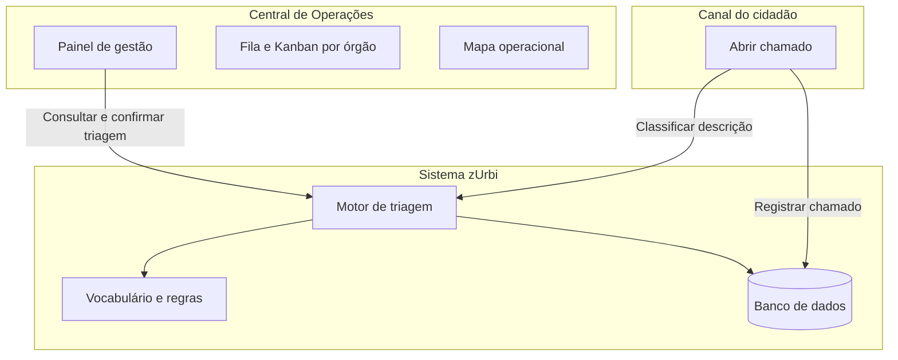

# Resumo das Implementações de Inteligência Artificial — zUrbi

**Documento:** Relatório técnico de entregas  
**Projeto:** zUrbi — Gestão de ocorrências urbanas (Porto Seguro, BA)  
**Versão do motor:** Triagem por regras v1  
**Data de referência:** maio/2026  
**Público-alvo:** gestão de produto, equipe técnica e stakeholders  

---

## 1. Contexto e propósito deste documento

Até recentemente, o zUrbi operava como uma plataforma de registro e acompanhamento de ocorrências urbanas **sem capacidades de inteligência artificial**. Cadastros, encaminhamentos e visualizações dependiam de escolhas manuais ou de regras fixas simples (por exemplo, vínculo de órgão apenas pela categoria informada no momento do registro).

**Este documento registra o primeiro passo da incorporação de IA no projeto:** um motor de **triagem automática** que lê a descrição do problema e apoia a classificação e o encaminhamento dos chamados. Não se trata da versão final da solução — é uma **base sólida e evolutiva**, pensada para demonstrar valor rapidamente e permitir melhorias contínuas com base no uso real e no feedback da prefeitura.

Pretendemos evoluir em direções como triagem totalmente automática no momento do registro, priorização inteligente da fila de trabalho, integração com modelos de linguagem em casos complexos e métricas de desempenho do motor. O que está descrito aqui é o que **já está implementado e em uso** na aplicação.

---

## 2. Sumário executivo

Foi implementado um **motor de triagem inteligente baseado em regras explicáveis** (não utiliza chatbot nem modelo de linguagem generativo em produção). O sistema analisa o texto e os metadados dos chamados para sugerir:

- **Categoria** e **tipo de problema**
- **Órgão responsável** previsto
- **Prioridade** e **status** sugeridos
- **Nível de confiança** e **motivos** em linguagem clara, para auditoria e decisão humana

A IA está presente em **dois momentos do fluxo**:

1. **Abertura de chamado (cidadão)** — após descrever o problema, o sistema sugere categoria e tipo antes do envio.
2. **Central de Operações (gestor)** — ao analisar um chamado, o gestor vê a sugestão da máquina e pode **confirmar o encaminhamento**, gravando órgão, status e histórico no banco de dados.

A abordagem inicial prioriza **transparência, baixo custo e previsibilidade**: cada sugestão pode ser explicada (“por que Limpeza?”, “por que SLU?”). Esse é o primeiro degrau da inteligência no zUrbi; os próximos degraus ampliarão automação e sofisticação sem abandonar essa rastreabilidade.

---

## 3. O que entendemos por “IA” no zUrbi (nesta versão)

| Incluído nesta entrega | Ainda não faz parte desta entrega |
|------------------------|-----------------------------------|
| Análise de texto por palavras-chave e regras de negócio | Modelos de linguagem (ChatGPT, etc.) em produção |
| Sugestão de categoria, tipo, órgão, urgência e confiança | Aprendizado de máquina com modelo treinado |
| Card de “triagem automática” na interface | Leitura e interpretação de fotos anexadas |
| Confirmação de encaminhamento pelo gestor com persistência | Autenticação real via Gov.br |
| Classificação auxiliar no navegador se o servidor estiver indisponível | Painel de métricas e acurácia do motor |

Serviços complementares — como **preencher endereço pelo mapa** (geocodificação) — melhoram a experiência do cidadão, mas **não são o motor de triagem**; são citados apenas onde ajudam a entender o fluxo completo.

---

## 4. Visão geral da solução



O **backend** concentra a lógica de triagem. As telas consomem essa lógica via API. Em situação excepcional (servidor indisponível), o formulário do cidadão ainda consegue uma classificação básica no próprio navegador, com as mesmas regras simplificadas.

---

## 5. O que foi implementado

### 5.1 Motor de triagem no servidor

**Local no código:** `zurbi-backend/src/main/java/br/com/zurbi/modules/triagem/`

| Peça | Função |
|------|--------|
| Vocabulário de termos | Reconhece palavras relacionadas a iluminação, saneamento, trânsito, limpeza, viário e emergência (~150 termos) |
| Serviço de triagem | Calcula sugestões, confiança, prioridade e aplica encaminhamento quando o gestor confirma |
| APIs REST | Expõem consulta, confirmação e classificação antes do registro |

**Comportamento principal do motor (versão atual):**

- Textos que indicam **emergência** (acidente, incêndio, enchente grave, etc.) direcionam para a Defesa Civil (**DCM**) e status de emergência.
- A **categoria** é inferida pela descrição (ex.: “lixo na rua” → Limpeza; “poste apagado” → Iluminação).
- O **tipo de problema** é sugerido de forma alinhada às opções do formulário (ex.: “Lixo acumulado”).
- O **órgão** é escolhido conforme as categorias que cada secretaria atende no cadastro municipal.
- **Prioridade** e **confiança** são scores calculados a partir da urgência, risco de acidente, recorrência e qualidade do match textual.
- Chamados já **concluídos** ou **cancelados** não têm status alterado pela triagem.

No registro inicial do chamado, o sistema ainda pode pré-atribuir um órgão pela categoria informada; a triagem na Central **refina ou corrige** encaminhamentos, especialmente quando o chamado chega sem órgão definido.

---

### 5.2 Central de Operações com triagem integrada

**Acesso:** menu **Operações** (`/central-ia`)

| Recurso | Descrição |
|---------|-----------|
| Fila de chamados | Listagem com filtros por status, bairro e busca textual |
| Painel de detalhe | Ao selecionar um chamado, carrega a **sugestão da IA**: órgão, confiança (%), motivos e status sugerido |
| Confirmar encaminhamento | Botão que **grava** a sugestão: órgão responsável, atualização de status e linha no histórico (“Triagem automática: encaminhado para…”) |
| Kanban por órgão | Visualização em colunas; arrastar um card pode alterar o órgão responsável |
| Mapa operacional | Google Maps com marcadores coloridos por urgência, apenas chamados **em aberto** |
| Indicadores | Totais de chamados, fila, urgência alta, concluídos, etc. |

Antes desta entrega, a Central podia exibir indícios calculados apenas no navegador, **sem gravar** no banco. Agora a triagem é **oficial**: vem do servidor e pode ser confirmada pelo gestor.

---

### 5.3 Abertura de chamado com classificação automática

**Acesso:** **Abrir chamado** (`/registrar`)

| Momento | O que acontece |
|---------|----------------|
| Cidadão descreve o problema | Texto livre no mapa de Porto Seguro, com bairro (lista oficial de 56 bairros) e indicação de risco/recorrência |
| Ao avançar para o próximo passo | O sistema envia a descrição ao motor de triagem |
| Tela seguinte | Card **“Triagem automática”** com confiança, órgão previsto e motivos; campos **categoria** e **tipo** já preenchidos (editáveis) |
| Urgência | Definida pelo motor — o cidadão **não** escolhe manualmente o nível |
| Envio | Chamado registrado com os dados classificados |

**Exemplo:** *“lixo na rua”* → categoria **Limpeza**, tipo **Lixo acumulado**, encaminhamento previsto para **Secretaria de Limpeza Urbana (SLU)**.

Se o servidor de triagem não responder, o formulário aplica regras equivalentes localmente e informa que a classificação foi feita em modo reserva.

---

### 5.4 Apoios à jornada do cidadão (complementares)

| Recurso | Finalidade |
|---------|------------|
| Geocodificação | Sugerir endereço a partir do ponto marcado no mapa |
| Lista oficial de bairros | Padronizar localização conforme cadastro municipal |
| Dados de demonstração | Cerca de 50 chamados em Porto Seguro para testes e apresentações |

---

## 6. APIs disponíveis

| Operação | Endpoint | Quem usa |
|----------|----------|----------|
| Classificar texto (sem gravar chamado) | `POST /api/triagem/classificar` | Abertura de chamado |
| Consultar triagem de um chamado | `GET /api/ocorrencias/{id}/triagem` | Central de Operações |
| Confirmar encaminhamento | `POST /api/ocorrencias/{id}/triagem/aplicar` | Central de Operações |
| Alterar órgão manualmente | `PATCH /api/ocorrencias/{id}/orgao` | Kanban / gestão |

**Exemplo de classificação na abertura:**

```http
POST /api/triagem/classificar
Content-Type: application/json

{
  "descricao": "lixo na rua",
  "riscoAcidente": false,
  "recorrente": false
}
```

A resposta traz, entre outros campos: `categoria`, `subcategoria`, `urgenciaSugerida`, `orgaoNome`, `orgaoSigla`, `confianca`, `motivos` e `emergencia`.

Mais detalhes técnicos: `docs/api-endpoints.md` e `docs/testing-guide.md`.

---

## 7. Ambiente de demonstração

| Item | Detalhe |
|------|---------|
| Município piloto | Porto Seguro, BA |
| Órgãos cadastrados | Obras (SOI), Iluminação (CIP), Saneamento (CAS), Limpeza (SLU), Defesa Civil (DCM) |
| Base de testes | 50 ocorrências de exemplo no banco |
| Cenário típico de demo | Chamado sem órgão (`ZUR-2026-0046`) para o gestor confirmar a triagem na Central |

---

## 8. Como o gestor utiliza a triagem

1. Entrar em **Operações**.
2. Selecionar um chamado na fila (idealmente um ainda sem órgão definido).
3. Ler a sugestão: órgão, percentual de confiança e lista de motivos.
4. Clicar em **Confirmar encaminhamento** — o sistema persiste a decisão e registra no histórico.
5. Opcionalmente, reorganizar chamados no **Kanban** ou localizar no **mapa**.

O gestor **mantém o controle**: a IA sugere; a confirmação humana (nesta versão) é o que oficializa o encaminhamento.

---

## 9. Como o cidadão utiliza a triagem

1. Entrar em **Abrir chamado**.
2. Marcar o local, descrever o problema e informar bairro e sinais de risco.
3. Avançar — o sistema classifica automaticamente.
4. Revisar categoria e tipo sugeridos; ajustar se necessário.
5. Confirmar e enviar — receber o protocolo.

A experiência comunica que o município **entende o relato** antes mesmo de encaminhar formalmente o chamado.

---

## 10. Limitações da versão atual

- **Vocabulário fixo:** relatos muito atípicos ou vagos podem receber categoria genérica (Viário) ou exigir correção manual.
- **Confiança:** é um indicador calculado por regras, não uma probabilidade estatística calibrada em produção.
- **Sem modelo de linguagem:** não há interpretação profunda de contexto como faria um LLM.
- **Infraestrutura:** após atualizações do backend, é necessário reconstruir o container Docker (`docker compose up -d --build app`) para que todas as APIs de triagem respondam corretamente.
- **Autenticação:** ambiente de demonstração com login simulado; perfis e permissões de gestor serão endurecidos depois.

Essas limitações são **conhecidas e aceitas** para um primeiro ciclo; orientam o que melhorar nas próximas iterações.

---

## 11. Próximos passos pretendidos

A evolução natural do que foi entregue — sem compromisso de datas neste documento — inclui:

| Direção | Benefício esperado |
|---------|-------------------|
| Triagem automática ao registrar o chamado | Menos chamados “parados” aguardando gestor |
| Fila ordenada por prioridade inteligente | Gestor atende primeiro o que mais importa |
| Modelo de linguagem em casos ambíguos | Melhor leitura de textos longos ou confusos |
| Métricas e histórico de decisões do motor | Ajuste fino das regras e transparência para a gestão pública |
| Integração plena das demais telas (acompanhamento, admin) | Experiência única em todo o portal |

O plano técnico detalhado para a equipe de desenvolvimento permanece em `docs/triagem-ia.md`, como referência interna de engenharia.

---

## 12. Principais componentes no repositório

**Backend:** `TriagemService`, `TriagemKeywords`, controladores e DTOs em `modules/triagem/`

**Frontend:** `CentralIA.jsx`, `CentralIADetalhe.jsx`, `CentralIAKanban.jsx`, `CentralIAMapa.jsx`, `OcorrenciaForm.jsx`, `services/triagem.js`, `utils/triagemLocal.js`

**Documentação:** `docs/triagem-ia.md`, `docs/testing-guide.md`, `docs/api-endpoints.md`, `docs/business-rules.md`

---

## 13. Conclusão

O zUrbi deu **o primeiro passo concreto em direção à inteligência artificial**: saiu de um cadastro passivo para um sistema que **interpreta relatos**, **sugere encaminhamentos** e **apoia gestores e cidadãos** com explicações claras. A solução já é demonstrável de ponta a ponta — da descrição “lixo na rua” até a confirmação na Central de Operações.

Começamos com regras transparentes de forma proposital: é a fundação sobre a qual pretendemos evoluir para mais automação e, quando fizer sentido, modelos mais avançados — sempre preservando o que a gestão pública exige: **saber por que o sistema tomou cada decisão**.

---

*Documento alinhado ao estado do código em maio/2026. Atualizar este resumo quando novas capacidades de IA forem incorporadas ao produto.*
