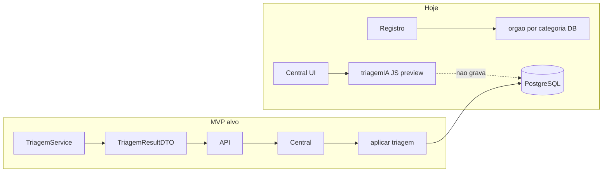
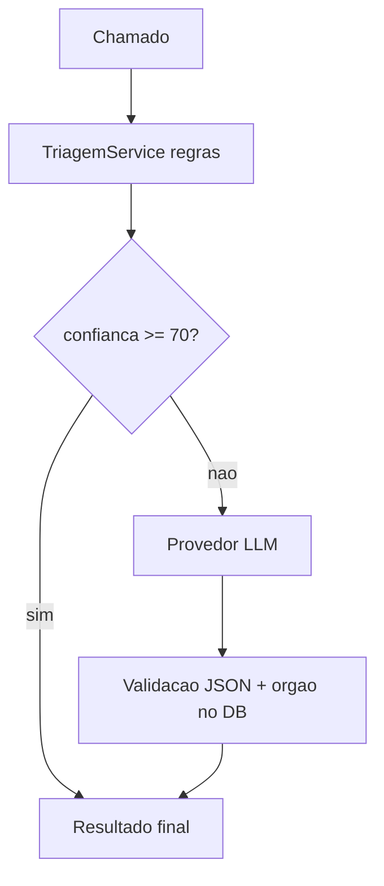

# Plano de IA e Triagem — zUrbi

Documento de referência para implementação e roadmap. **Entrega mínima obrigatória:** triagem automática funcionando de ponta a ponta (backend + Central de Operações com confirmação persistida).

---

## 1. Objetivo e entrega mínima

**Objetivo:** permitir que chamados urbanos sejam **triados automaticamente** (órgão, status sugerido, prioridade e explicação), com possibilidade do gestor **confirmar** o encaminhamento na Central de Operações (`/central-ia`).

### Entrega mínima (MVP)

| # | Requisito |
|---|-----------|
| 1 | Triagem calculada no **backend** (fonte única da verdade) |
| 2 | Gestor vê sugestão, confiança e motivos na Central |
| 3 | Botão **Confirmar encaminhamento** persiste `orgao_id`, status e histórico em `tb_atualizacao_status` |

### Fora do MVP (fases futuras)

- LLM / modelo de linguagem
- Triagem automática no momento do registro pelo cidadão
- Autenticação de gestor
- Mapa Google na Central
- Integração completa das páginas Mapa/Admin/Acompanhar com API
- Modo escuro, fotos MinIO na Central

---

## 2. Estado atual (baseline)

| Item | Situação |
|------|----------|
| Dados demo | 50 ocorrências Porto Seguro — `V4__seed_porto_seguro.sql` |
| Órgãos + categorias | 5 órgãos em `tb_orgao` / `tb_orgao_categorias` |
| Registro | `OcorrenciaService.registrar` atribui órgão por categoria (`findFirstByCategoriasAtendidasContaining`) |
| Central de Operações | UI em `CentralIA.jsx`; preview em `centralIa.js` — **não persiste** |
| Botão confirmar | Desabilitado — sem endpoint de aplicar triagem |



---

## 3. Visão das fases

| Fase | Nome | Entrega | Prioridade |
|------|------|---------|------------|
| **1** | Motor de triagem (regras) | Backend + API consultar/aplicar | **Obrigatória (MVP)** |
| **2** | Central conectada | Frontend consome API; botão ativo | **Obrigatória (MVP)** |
| **3** | Triagem no registro | Auto-triagem ao criar chamado | Alta (pós-MVP) |
| **4** | Fila inteligente | Ordenação por score de prioridade | Média |
| **5** | IA híbrida (LLM) | Modelo só em casos ambíguos | Futura |
| **6** | Observabilidade | Métricas, acurácia, auditoria | Futura |

**MVP = Fase 1 + Fase 2.**

---

## 4. Fase 1 — Motor de triagem no backend (regras explicáveis)

### 4.1 Objetivo

Substituir lógica espalhada (JavaScript na Central + atribuição parcial no `registrar`) por um serviço único, testável e auditável.

### 4.2 Estrutura sugerida

```
zurbi-backend/src/main/java/br/com/zurbi/modules/triagem/
  TriagemService.java
  TriagemController.java
  dto/TriagemResponseDTO.java
  dto/AplicarTriagemRequestDTO.java   (opcional: observação do gestor)
```

### 4.3 Regras do motor (v1)

1. **Órgão por categoria**  
   `OrgaoRepository.findFirstByCategoriasAtendidasContaining(categoria)` — mesma fonte do registro; nomes vindos do banco.

2. **Palavras-chave** em `subcategoria` + `descricao` (texto normalizado, sem acento). Vocabulário completo em [`TriagemKeywords.java`](../zurbi-backend/src/main/java/br/com/zurbi/modules/triagem/TriagemKeywords.java) (~150+ termos).

   - **Emergência** → órgão **DCM**, status `ENCAMINHADO_EMERGENCIA`. Ex.: acidente, colisão, atropelamento, incêndio, desabamento, enchente, poste caído, fio partido, vítima, bombeiro.
   - **Inferência de categoria** (ordem de especificidade: Iluminação → Saneamento → Trânsito → Limpeza → Viário):
     - **ILUMINACAO:** poste, lâmpada, luz apagada, escuro, luminária, piscando…
     - **SANEAMENTO:** esgoto, vazamento, bueiro, fossa, mau cheiro, transbordo, hidrômetro…
     - **TRANSITO:** semáforo, sinalização, placa de pare, faixa, lombada, congestionamento…
     - **LIMPEZA:** lixo, entulho, mato, capina, coleta, poda, foco de dengue…
     - **VIARIO:** buraco, pavimento, calçada, asfalto, meio-fio, cratera, afundamento…
   - Se o texto indica **outra categoria** que a registrada, o órgão sugerido usa a categoria inferida (menos erro na triagem automática no registro).

3. **Prioridade (score numérico):**  
   base + urgência (ALTA +30, MEDIA +15) + `riscoAcidente` (+20) + `recorrente` (+10).

4. **Confiança (0–100):**  
   pesos somados (categoria com órgão no DB +40, keyword +25, urgência +15, etc.), teto 98.  
   Sem órgão no DB → `requerRevisaoHumana = true`, confiança limitada (~62).

5. **Status sugerido:**  
   padrão `EM_ANALISE` após triagem; emergência → `ENCAMINHADO_EMERGENCIA`.  
   Se status já `CONCLUIDO` ou `CANCELADO` → não sugerir mudança de status.

### 4.4 Endpoints

| Método | Path | Comportamento |
|--------|------|----------------|
| `GET` | `/api/ocorrencias/{id}/triagem` | Retorna sugestão (somente leitura) |
| `POST` | `/api/ocorrencias/{id}/triagem/aplicar` | Aplica triagem: `orgao_id`, status, histórico |

**Exemplo de resposta (`TriagemResponseDTO`):**

```json
{
  "ocorrenciaId": "uuid",
  "orgaoId": "uuid",
  "orgaoNome": "Companhia Independente de Iluminação",
  "orgaoSigla": "CIP",
  "statusAtual": "RECEBIDO",
  "statusSugerido": "EM_ANALISE",
  "prioridadeScore": 75,
  "confianca": 88,
  "motivos": [
    "Categoria ILUMINACAO mapeada ao órgão CIP.",
    "Urgência alta."
  ],
  "requerRevisaoHumana": false,
  "alinhadoComOrgaoAtual": true
}
```

### 4.5 Persistência ao aplicar

- Atualizar `tb_ocorrencia.orgao_id` e `status`.
- Inserir em `tb_atualizacao_status` com observação, por exemplo:  
  `Triagem automática: encaminhado para {orgao} — {motivo resumido}`.
- Reutilizar padrão de `OcorrenciaService.atualizarStatus` (histórico imutável, nunca sobrescrever).
- `resolvidoEm` apenas se status → `CONCLUIDO`.

### 4.6 Critérios de aceite — Fase 1

- [x] `GET /triagem` retorna sugestão coerente para chamados do seed (ex.: ILUMINACAO → CIP).
- [x] Chamados com `orgao_id` null recebem sugestão (`requerRevisaoHumana` apenas se não houver órgão sugerido).
- [x] `POST .../triagem/aplicar` persiste órgão, status e uma linha no histórico.
- [x] Apenas DTOs expostos na API (sem entidade JPA direta).

### 4.7 Documentação a atualizar nesta fase

- `docs/api-endpoints.md` — novos endpoints.
- `docs/testing-guide.md` — exemplos `curl` de triagem e aplicar.
- Este arquivo (`docs/triagem-ia.md`) — manter regras alinhadas ao código.

---

## 5. Fase 2 — Central de Operações integrada (MVP completo)

### 5.1 Objetivo

Triagem **visível e acionável** na UI — critério de “triagem acontecendo” para stakeholders.

### 5.2 Alterações no frontend

| Arquivo | Mudança |
|---------|---------|
| `frontend/src/services/triagem.js` | **Criar** — `obterTriagem(id)`, `aplicarTriagem(id)` |
| `frontend/src/pages/CentralIA.jsx` | Ao selecionar: `GET triagem`; botão: `POST aplicar`; refresh fila/detalhe |
| `frontend/src/utils/centralIa.js` | Remover ou reduzir `triagemIA` local; manter apenas helpers de label/UI |

### 5.3 UX

- Loading ao buscar triagem.
- Mensagem clara se API indisponível.
- Após aplicar: feedback (toast ou inline) + atualizar fila (status, órgão).
- Botão desabilitado apenas quando não houver órgão sugerido **e** `requerRevisaoHumana` (opcional: confirmação extra se gestor insistir).

### 5.4 Critérios de aceite — Fase 2

- [x] Gestor abre `/central-ia`, seleciona chamado sem órgão (ex. `ZUR-2026-0046`) → vê sugestão e motivos da API.
- [x] **Confirmar encaminhamento** → `orgao_id` preenchido no banco e status conforme sugestão.
- [x] Histórico exibe entrada de triagem automática.
- [x] Recarregar a página mantém dados persistidos.

---

## 6. Fase 3 — Triagem automática no registro (futuro próximo)

**Objetivo:** cidadão reporta → sistema encaminha sem passo manual do gestor.

- Em `OcorrenciaService.registrar`, após salvar:
  - Se `orgao_id` null **ou** confiança &gt; limiar (ex.: 80): chamar `TriagemService.aplicar` internamente.
- Histórico: `Triagem automática no registro`.
- Central mostra fila já triada (menos itens “pendentes de órgão”).

**Critério de pronto:** novo chamado via API aparece com órgão e `EM_ANALISE` sem intervenção humana.

---

## 7. Fase 4 — Fila inteligente e priorização (futuro)

**Objetivo:** ordenar a fila da Central por impacto, não só por data.

- `GET /api/ocorrencias?ordenar=prioridade` ou endpoint batch com scores.
- Badges Alta / Média / Baixa na fila.
- Cruzar com gráficos por bairro (volume + prioridade).

---

## 8. Fase 5 — IA híbrida com LLM (futuro)

**Objetivo:** melhorar casos ambíguos (descrição longa, categoria incorreta, texto livre).



| Aspecto | Decisão |
|---------|---------|
| Quando chamar LLM | Confiança das regras &lt; 70% |
| Provedor | OpenAI / Azure OpenAI / Ollama via `application.properties` |
| Saída | JSON: categoria, orgaoSigla, urgencia, motivo |
| Segurança | Validar `orgaoSigla` contra `tb_orgao`; nunca confiar cegamente |
| Dev | `triagem.llm.enabled=false` por padrão |
| Dados | Evitar PII desnecessária no prompt |
| Custo | Limite de tokens; log auditável de prompts/respostas |

---

## 9. Fase 6 — Observabilidade e melhoria contínua (futuro)

- Métricas: % triagem automática vs revisão humana; tempo até `EM_ANALISE`; taxa de confirmação sem alteração de órgão.
- Export ou painel interno para ajustar regras.
- Versões do motor (A/B regras v1 vs v2).
- Tabela opcional `tb_triagem_log` (ocorrencia_id, versao_motor, json_resultado, aplicado_em).

---

## 10. Arquivos principais (MVP)

| Ação | Arquivo |
|------|---------|
| Criar | `modules/triagem/*` (service, controller, DTOs) |
| Alterar / criar | Controller de triagem ou extensão em `OcorrenciaController` |
| Criar | `docs/triagem-ia.md` (este documento) |
| Alterar | `docs/api-endpoints.md`, `docs/testing-guide.md` |
| Criar | `frontend/src/services/triagem.js` |
| Alterar | `frontend/src/pages/CentralIA.jsx` |
| Alterar | `frontend/src/utils/centralIa.js` |

**Não alterar:** migrações Flyway V1–V4 já aplicadas; comportamento novo só em código e documentação.

---

## 11. Riscos e mitigação

| Risco | Mitigação |
|-------|-----------|
| Divergência JS vs backend | Remover heurística duplicada no frontend no MVP |
| Dois órgãos para TRANSITO (SOI e DCM) | Emergência → DCM; demais casos de trânsito → SOI |
| Aplicar triagem em status final | Bloquear ou validar transição se CONCLUIDO/CANCELADO |
| LLM antes das regras estáveis | Fase 5 só após Fases 1–2 em produção/demo |

---

## 12. Cronograma sugerido (referência)

| Semana | Entrega |
|--------|---------|
| 1 | Fase 1 — `TriagemService` + endpoints + testes `curl` |
| 1–2 | Fase 2 — Central integrada → **demo “triagem acontecendo”** |
| 3+ | Fase 3 (auto no registro) |
| 4+ | Fases 4–6 conforme prioridade de produto |

---

## 13. Definição de pronto — MVP

1. [x] `GET /api/ocorrencias/{id}/triagem` documentado e funcional.
2. [x] `POST /api/ocorrencias/{id}/triagem/aplicar` persiste órgão, status e histórico.
3. [x] Central exibe sugestão **da API** (não só cálculo local).
4. [x] Botão **Confirmar encaminhamento** executa aplicar e atualiza a UI.
5. [x] Cenário demonstrável: chamado sem órgão no seed (ex. `ZUR-2026-0046`).

Fases 3–6 são **roadmap**; não bloqueiam a entrega mínima.

---

## 14. Checklist de implementação (para o time)

### MVP (obrigatório)

- [x] **Fase 1** — `TriagemService` + DTOs + GET/POST triagem
- [x] **Fase 1** — Atualizar `api-endpoints.md` e `testing-guide.md`
- [x] **Fase 2** — `services/triagem.js` + `CentralIA.jsx`
- [x] **Fase 2** — Validar chamados sem órgão (ex. `ZUR-2026-0046`) e critérios da seção 13

### Resumo para stakeholders

- [x] **Primeira entrega de IA no produto** — ver [`resumo-implementacoes-ia.md`](resumo-implementacoes-ia.md) (linguagem institucional, sem referência a fases internas)

### Extensões entregues (além do MVP técnico)

- [x] **Abertura de chamado** — `POST /api/triagem/classificar` + `OcorrenciaForm` (passo 2 com sugestão de categoria/tipo)
- [x] **Central** — Kanban por órgão, mapa Google Maps, `PATCH /orgao`

### Futuro

- [ ] **Fase 3** — Auto-triagem em `OcorrenciaService.registrar`
- [ ] **Fase 4** — Ordenação da fila por `prioridadeScore`
- [ ] **Fase 5** — LLM híbrido com feature flag
- [ ] **Fase 6** — Métricas e `tb_triagem_log`

---

## 15. Referências no repositório

- Regras de negócio: [`business-rules.md`](business-rules.md)
- Seed demo: [`V4__seed_porto_seguro.sql`](../zurbi-backend/src/main/resources/db/migration/V4__seed_porto_seguro.sql)
- Central UI: [`CentralIA.jsx`](../frontend/src/pages/CentralIA.jsx)
- Vocabulário de triagem: [`TriagemKeywords.java`](../zurbi-backend/src/main/java/br/com/zurbi/modules/triagem/TriagemKeywords.java)
- Testes manuais: [`testing-guide.md`](testing-guide.md)
